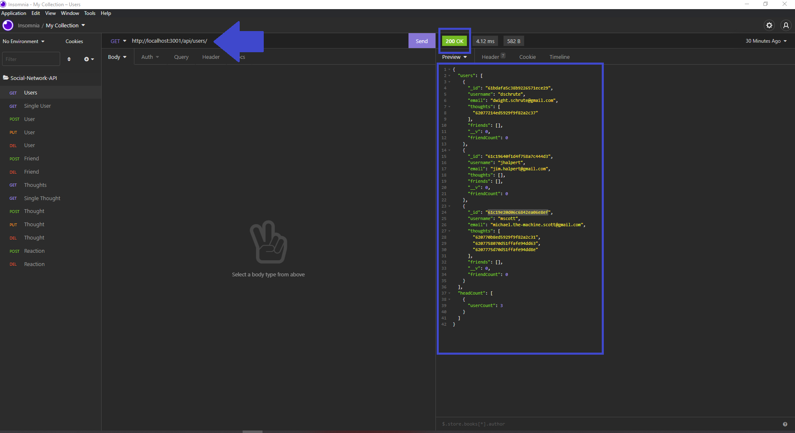

# Social-Network-API

## Description
This application is an API for social network web applications. It uses Express.js for routing, a MongoDB database, and the Mongoose ODM. The application can be cloned and run locally, see [Installation](#installation) and [Usage](#usage) for more details. This application was created for a social media startup to handle large amounts of unstructured data.

## Table of Contents
- [Installation](#installation)
- [Usage](#usage)
- [Contributing](#contributing)
- [Questions](#questions)
- [License](##license)

## Demo

&#8594; [DEMO Video](https://drive.google.com/file/d/1OaSCF-4akyViGgwkLAPm899teSYR7Okl/view?usp=sharing) &#8592;

## Installation

How to install this application and getting started:

* Clone the repo to your local machine
* Open the integrated terminal
* Run `npm install` which will install any dependencies an all three package.json files
* Run `node index.js` which will start the API Server at http://localhost:3001/
* You can use a API Client like Insomnia to test the API

## Usage

### Step 1
> **Note**: Not all available options and steps will be demonstrated here
* After the command has been invoked you will see `API server for undefined running on port 3001!`

### Step 2
* To make a PUT Request enter `http://localhost:3001/api/users/` and click `Send`
* You will see the Status show `200` and the Preview of the response .json

### Step 3
* To make a POST Request enter `http://localhost:3001/api/users/`
* Include a and JSON Body and enter username & email, click `Send`
* You will see the Status show `200` and the Preview of the response .json

### Step 4
* To make a PUT Request enter http://localhost:3001/api/users/"`USER_ID`"
* You will see the Status show `200` and the Preview of the response .json

### Step 5
* To make a PUT Request enter http://localhost:3001/api/users/"`USER_ID`"
* You will see the Status show `200` and the Preview letting you know "User and thoughts were deleted!"

> **Note**: Not all applications options are demonstrated or depicted here

## Contributing
There are many ways in which you can participate in this project, for example:

* Submit bugs and feature requests
* Review source code changes
* Review the documentation and make pull requests for anything from typos to additional and new content

## Questions
To find more information and the repository on this project please visit my [GitHub](https://github.com/israelmrios).

For any additional questions please email me [here](mailto:israelm.riosjr@gmail.com).

## License
Copyright (c) 2021 Israel M Rios.
Licensed under the [MIT License](LICENSE).